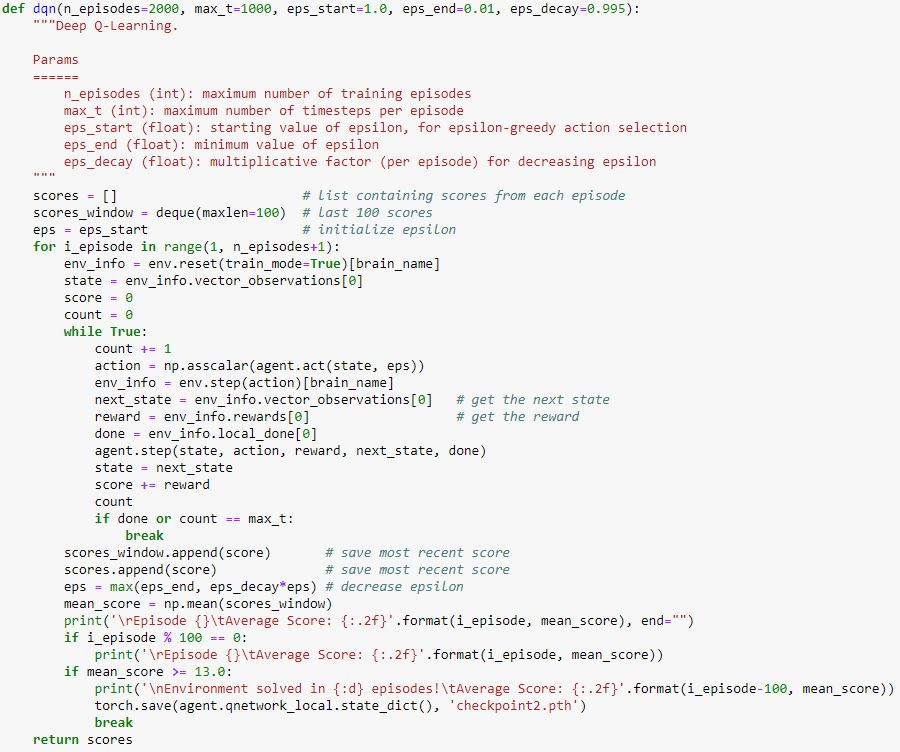
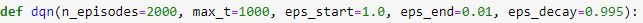
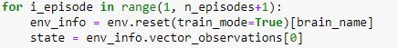
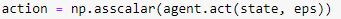
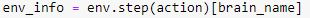
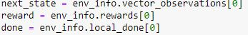
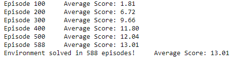
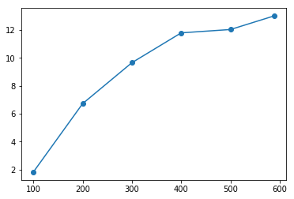

# Navigation Bananas
1.0 8/28/2018

INTRO
-----------

Navigation is an agent built to navigate through bananas trying to avoid blue bananas and to catch yellow ones.
This agent must maximize its reward and earns 1 when it grabs yellow bananas and loses 1 when it catch blue bananas.
The algorithm using the simple Deep-Q learning algorithm. This algorithm is made of two interleaved processes. One is where we sample the environment by performing actions, and we store experience tuple (S, A, R, S') in replay memory D and one who learns from that batch using gradient descent update step

## DESCRIPTION OF THE ALGORITHM

Our code is running in a loop with a finite number of episodes which is limited by the n_episodes parameter.

We start by resetting the environment with the 'env.reset' method, setting train_mode to True to accelerate the training.
Then we are getting the first state with the env_info.vector_observations method

We are then entering the timestep loop which is constrained by both the maximum number of timestep per episode parameter max_t and the possible end of the episode.

We are calling the agent.act method which takes as parameters the current state and epsilon and returns an action inferencing the Torch model.

This action is used as a parameter to take a step forward in the environment by passing it to the step method of the environment object and return a set of new observation

from those we are extracting the next state 'env_info.vector_observations[0]' and reward 'env_info.rewards[0]' and status of the environment.

Eventually, the step method of the agent is called which take as parameters state, action, reward, next_state and done, save experience in replay memory and call the learn method of the agent passing experience and gamma as parameters. The learn agent is computing the loss and is passing qnetwork_local and qnetwork_local as parameters to the soft_update method which in return update the model.

Then the loop is running for an other timestep until it reaches the conditions to break and start a new episode again.

## HYPERPARAMETERS

Hyperparameters did sufficiently well by remaining the same than for the Lunar Lander coding exercise ones. The buffer size was taken equal to 1e5, the batch size to 64, gamma to 0.99, tau to 1e-3, LR to 5e-4 and the network was updated every 4 steps.

## MODEL ARCHITECTURE OF THE NEURAL NETWORK

The architecture for the neural network remained the same than the one we use in the DQN coding exercise applied to the LunarLander, except that this time state and action were not the same sizes. The model was made of 2 hidden layers which are both convolving 64 filters. The entire algorithm didn't struggle to adapt since we achieved a score of 13 in less than 600 iterations.

## PLOT OF REWARD

## DISCUSSION

As Deep Q-learning tends to overestimate action values, I would later be tempted to improve it first with Double Q-Learning before taking a try with Deep Mind Rainbow algorithm and ultimately testing the OpenAI PPO algorithm which did wonders during The International of Dota 2 by winning for the first time against the 99.95th-percentile Dota players.
